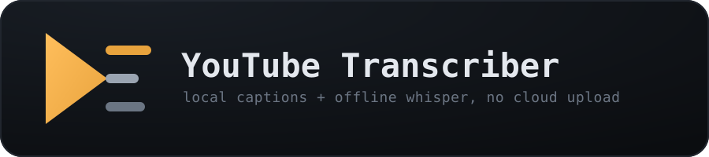
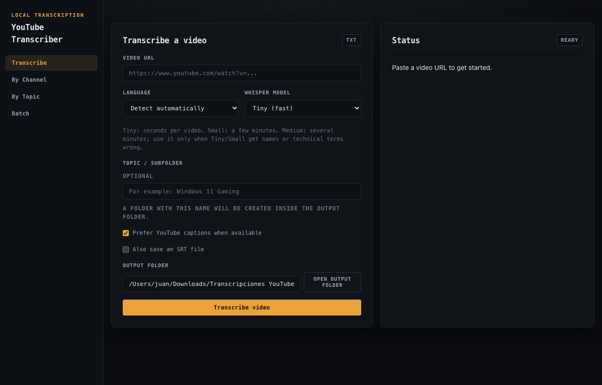
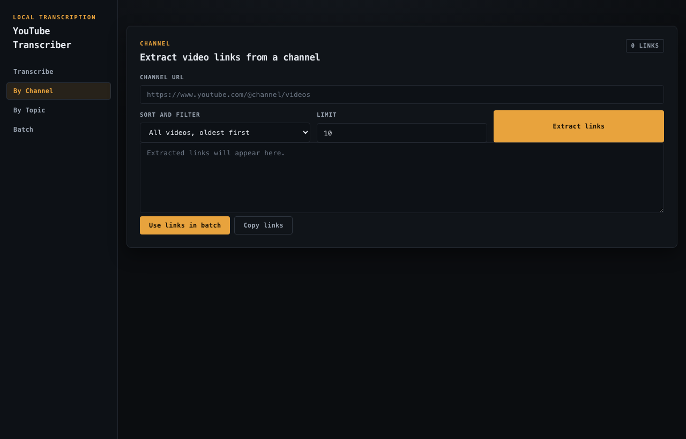
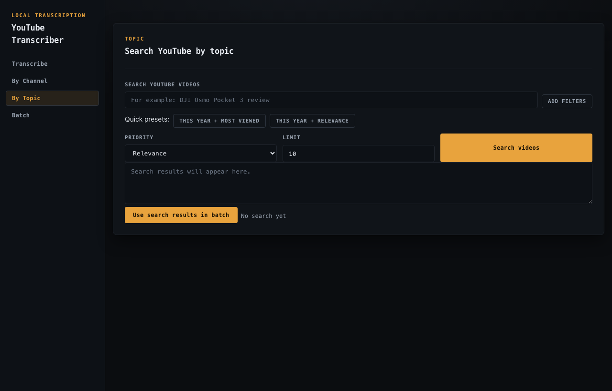
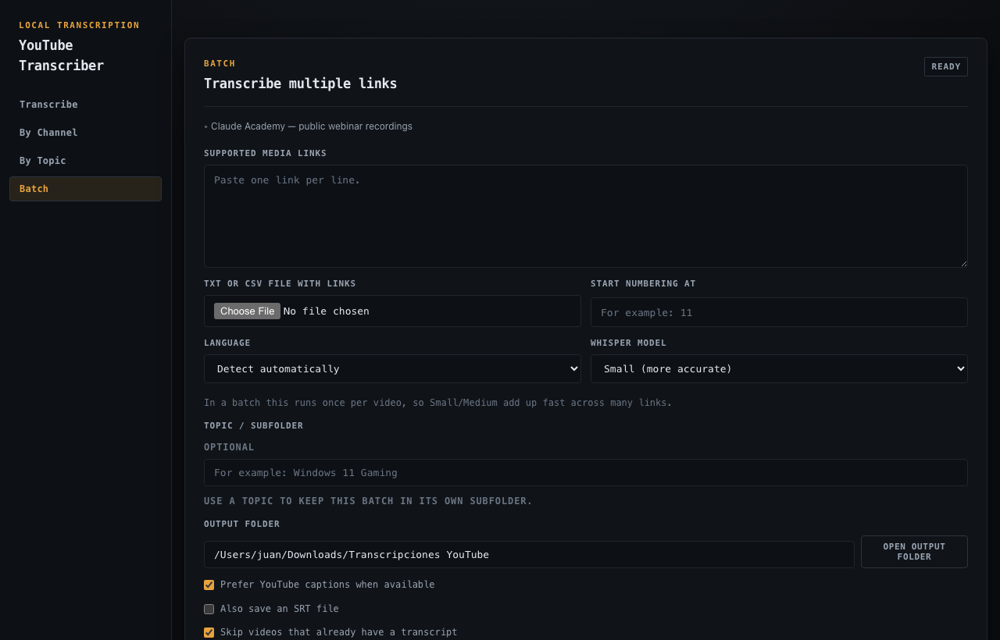

<p align="center">
  
</p>

# YouTube Transcriber

[](https://github.com/sheldor26/youtube-transcriber/actions/workflows/ci.yml)

A local, self-hosted app that turns YouTube videos into text transcripts (TXT/SRT) — no cloud upload, no API keys, no per-minute pricing. It reuses existing YouTube captions/subtitles when available and falls back to local, offline speech-to-text with [faster-whisper](https://github.com/SYSTRAN/faster-whisper) when there are none.

Useful for grabbing a searchable transcript or subtitle file from a tutorial, podcast, lecture, or webinar, transcribing an entire channel or topic in one batch, or building a text-based knowledge base from a set of videos — all running on your own machine.

## Screenshots

| | |
|---|---|
|  |  |
|  |  |

## Features

- Transcribe one supported video or a batch of links.
- Extract every video link from a channel, including oldest, newest, most-viewed, and most-liked selections.
- Search YouTube with filters for type, duration, upload date, captions, and ordering.
- Load all currently public, on-demand Claude Academy webinar recordings into a batch.
- Keep each topic in its own output subfolder.
- Save TXT by default, with optional SRT output.
- Skip videos that have already been transcribed.
- Resume interrupted batches from their state file.
- Create a local, extractive consolidated summary for a completed batch.
- Retry short-lived YouTube connection failures automatically.

## Requirements

- Python 3.10 or newer.
- `ffmpeg` available on your system for Whisper audio fallback.
- An internet connection to read public YouTube metadata and media.

Age-restricted, private, removed, or sign-in-only videos may not be available to the application.

## Supported sources

- Public YouTube video URLs.
- Public on-demand webinar recordings listed in [Claude Academy](https://academy.claude.com/webinars). The app accepts the YouTube and Anthropic Goldcast recordings published in that catalog; it does not bypass registrations, sign-in requirements, or other access controls.

## Install

```bash
git clone https://github.com/sheldor26/youtube-transcriber.git
cd youtube-transcriber
python3 -m venv .venv
source .venv/bin/activate
python -m pip install --upgrade pip
python -m pip install -r requirements.txt
```

## Run

```bash
source .venv/bin/activate
uvicorn app.main:app --host 127.0.0.1 --port 8000
```

Open [http://127.0.0.1:8000](http://127.0.0.1:8000) in your browser.

## How transcription works

1. The app checks for manual captions.
2. It then checks for automatic captions.
3. If no usable captions are available, it downloads the audio and runs Whisper locally.

The first Whisper job for a model downloads that model. `small` is a good accuracy-oriented default; `tiny` is best for quick drafts.

## Batch output

Each batch writes the following files to the selected output folder:

- `batch-index-<id>.csv`: a batch-specific record of every result.
- `transcription-index.csv`: a reusable index used to identify existing transcripts.
- `batch-state-<id>.json`: state needed to resume a batch after an interruption.
- `consolidated-summary-<id>.txt`: optional extractive summary, when enabled.

The summary is generated locally from transcript text. It is a starting point for review, not a statement of fact or semantic consensus.

## Test

```bash
source .venv/bin/activate
python -m unittest discover -s tests -v
```

Tests do not download videos or run Whisper.

## License

Released under the [MIT License](LICENSE).
